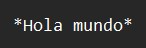
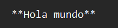
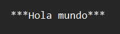
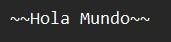
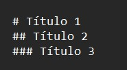
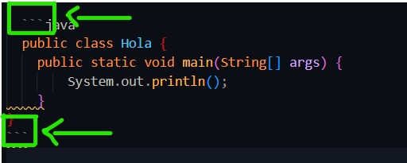
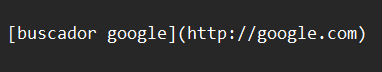
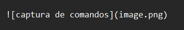
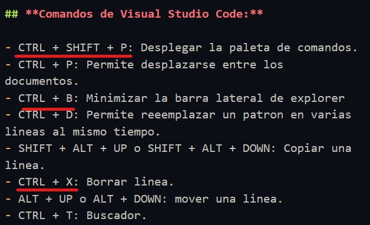
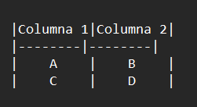

# MARKDOWN

Permite agregar formato a documentos de texto plano y crear contenido de una manera sencilla de escribir mostrando un diseño legible al momento de tomar apuntes de clase.

## SINTAXIS

- Para colocar un texto en cursiva, se usa un * antes y después del texto. Ejemplo:
  


*Hola mundo*

- Para un texto en negrita, se utilizan ** antes y después del texto. Ejemplo:
  


**Hola mundo**

- Para un texto en negrita y cursiva, se usan *** antes y después del texto. Ejemplo:
  


***Hola mundo***

- Para representar un texto tachado se escribe dos virgulillas seguidas antes y después del texto. Ejemplo:
  


~~Hola Mundo~~ 

- Para crear un título se utiliza un # antes del texto, separada por un espacio en blanco. Para crear subtítulos se insertan más #. Ejemplo:

# Título 1
## Título 2
### Título 3



- Para marcar un área de texto como código, se pone un acento al principio y otro al final del texto para delimitarla. Para iniciar y finalizar los bloques de código, se puede marcar el área correspondiente insertando tres acentos graves al principio y al final. Ejemplo: 
  

  
  ```java
  public class Hola {
    public static void main(String[] args) {
        System.out.println();
    }
}
```

- Para insertar un URL o una dirección de correo electrónico:



[buscador google](http://google.com)

- Para insertar una imagen:
  




- Para insertar tablas:



|Columna 1|Columna 2|
|--------|--------|
|    A    |    B    |
|    C    |    D    |

